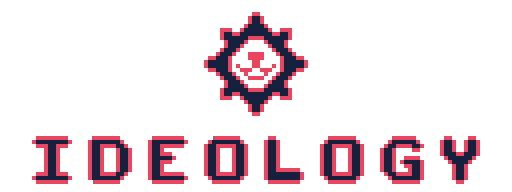

 

	

This document was created with the thought about the way to use all `CUTE` ecosystem's stuff.
The modular easy-to-extend flexible systems which could be used by any project together or one by one.
It sounds pretty... unreal? Yeah, definitely unreal, heh. BUT, sometimes we have try to do something
unreal. Whether or no `CUTE` ecosystem hasn't to set the world on fire. I just want to create
something, well, cute!

Of course, the 'cute' term is subjective and there will be a lot of people who'll say that this project
looks horrible and it'll hurt me. But it doesn't mean that I'll not find some like-minded persons
who'll sponsor me by starring this project. Well, I hope :harold:

And, I also understand that through the time this project will become like my nightmare. I just hope
it will not be so soon.

Anyway, \~enjoy your development\~

<h2 align="center"><code> - - GOALS - -</code></h2>

### There's just mundane goals at all:
 - To make a beauty codebase;
 - To make really useful game-dev tools;
 - Make a game engine, which is rounded by cute ecosystem;
